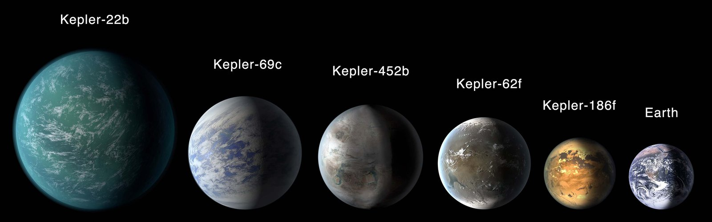

# Exoplanet Detection with Machine Learning



## Overview

This GitHub repository contains research materials, data analysis code, and Jupyter notebooks related to the project "Exoplanet Detection with Machine Learning." The project explores the use of machine learning algorithms, such as decision trees, gradient boosting, and random forest, to enhance the discovery and characterization of exoplanets in our universe.

## Project Structure

The repository is organized as follows:

### Data Analysis

This folder contains the data preprocessing and exploratory data analysis (EDA) code. It includes Python scripts and Jupyter notebooks used to clean, visualize, and analyze the exoplanet datasets.

### Machine Learning

This folder contains the implementation of machine learning algorithms for exoplanet detection. It includes Jupyter notebooks that demonstrate the application of decision trees, gradient boosting, and random forest for classification tasks.


## Requirements

To run the Jupyter notebooks and scripts in this repository, you will need the following dependencies:

- Python
- Jupyter Notebook
- NumPy
- Pandas
- Matplotlib
- Scikit-learn

You can install the required packages using the following command:

```
pip install numpy pandas matplotlib scikit-learn
```

## How to Use

1. Clone this repository to your local machine using:

```
git clone https://github.com/ShadowAsura/Exoplanet-Transit-Detection.git
```

2. Navigate to the relevant folders (`Data_Analysis` and `Machine_Learning`) to explore the code and Jupyter notebooks.

3. Run the Jupyter notebooks to execute the machine learning algorithms and visualize the results.
